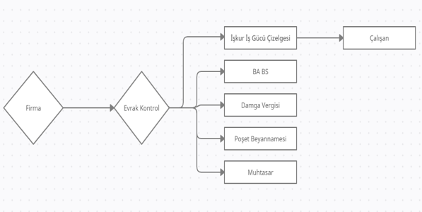

# Muhasebe Bildirim Kontrol Sistemi

Muhasebe Bildirim Kontrol Sistemi, Gürgen Mali Müşavirlik için geliştirilmiş bir muhasebe defter takip programıdır. Bu proje, mali müşavirlerin iş yükünü azaltmayı ve muhasebe süreçlerini daha verimli hale getirmeyi amaçlamaktadır.

## Proje Amacı

Bu proje, muhasebe süreçlerinde yaşanan zorlukları gidermek için tasarlandı. Gürgen Mali Müşavirlik'in sahibi ve aynı zamanda abim ile yaptığım bir konuşma sonucu ortaya çıkan bu fikir, aşağıdaki hedefleri gerçekleştirmeyi amaçlamaktadır:

- **Kolay Erişim:** Şirket ve çalışan bilgilerine tek bir platformdan erişim.
- **Hatırlatıcılar:** Beyannamelerin son tarihlerini hatırlatarak unutulmalarını önlemek.
- **Verimlilik:** Muhasebe süreçlerini düzenleyerek mali müşavirlerin iş yükünü azaltmak.

## Proje Özellikleri

- **Şirket Bilgileri Yönetimi:** Şirket bilgilerini kaydetme ve yönetme.
- **Çalışan Bilgileri Yönetimi:** Çalışan bilgilerini kaydetme ve yönetme.
- **Beyannameler ve Bildirimler:** Beyannamelerin son tarihlerini takip etme ve hatırlatma.

## Veritabanı Diyagramı

Projenin veritabanı yapısı aşağıdaki gibidir:

## Lisans

Bu proje öğrenci projesi olarak yapılmıştır ve herhangi bir lisans altında değildir.

---

Proje sahibi: Gülay Gürgen
